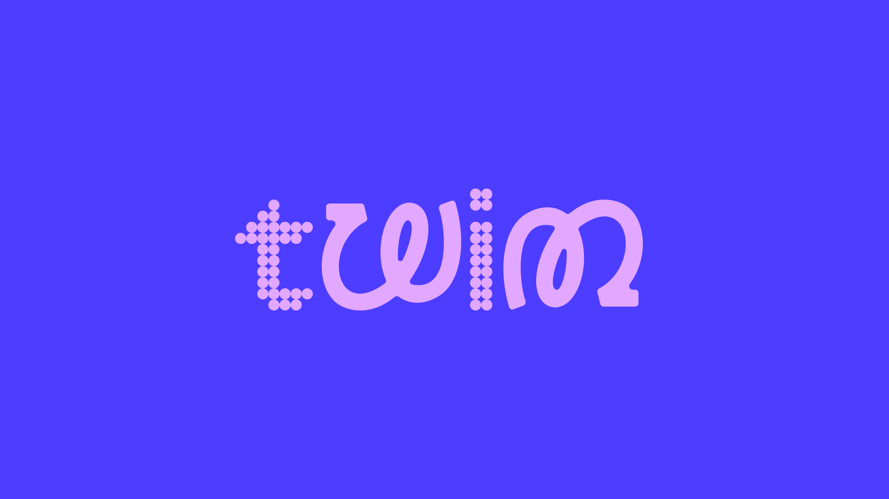
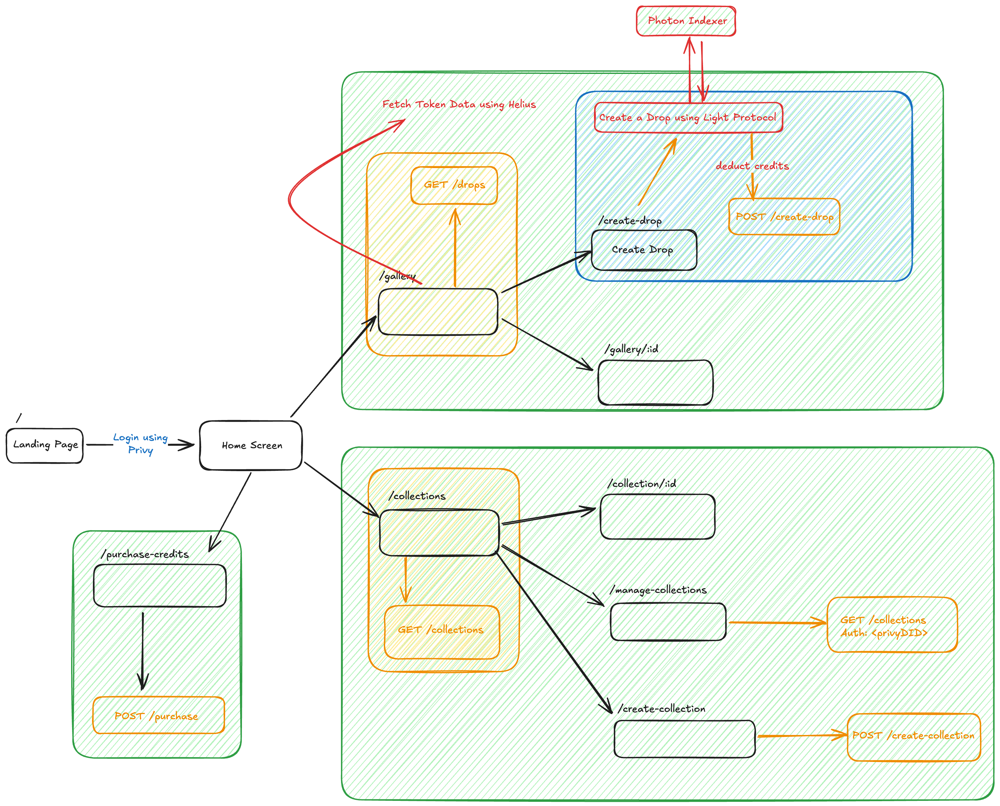

# Twinn

## About

Bookmark your Life, with Twinn - A digital badge for every moment you showed up.
### Features:

- Create ZK Compressed Token Drops
- It is a Proof of Attendance Protocol that allows you to mint memories as digital mementos 
1. **Mint**: Each POAP is created to tell a story.
2. **Drop**: Connect collectors to shared history.
3. **Connect**: Make your memories live forever.

## Tech Stack

- **Frontend**: TypeScript, NextJS, Zustand, React Tanstack Query, TailwindCSS
- **Backend**: Fastify, TypeScript, Prisma, PostgreSQL
- **Protocols**: Light Protocol, Privy

## Architecture

Built with ❤️  
Follow Us <a href="https://x.com/use_twinn">@use_twinn</a>